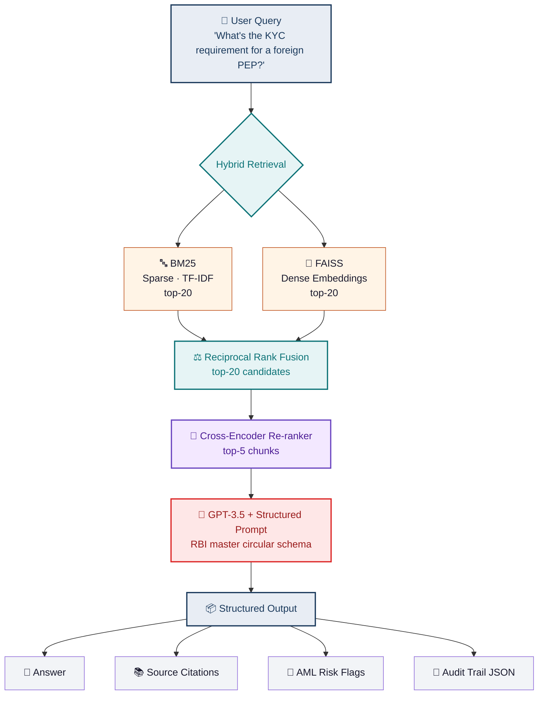

<div align="center">

# 🏛️ KYC Compliance RAG

### SEBI / RBI Regulatory Intelligence Agent

*Retrieval-constrained LLM that answers Indian KYC/AML compliance questions from 50+ regulatory circulars — with source-attributed audit trails and zero hallucination.*

<br>


<br>


</div>

<br>

---

<h2>
  
</h2>

> Indian financial institutions spend thousands of compliance-analyst hours cross-referencing SEBI and RBI circulars against customer onboarding flows.

A compliance analyst typically needs **15–25 minutes** to locate the right clause across the master circular, cross-check applicability, and document the decision for audit.

This system reduces that to **under 30 seconds** with full source attribution — every answer is grounded in the exact circular paragraph it came from.

<table>
<tr>
<td width="33%" align="center">

### 🎯
**Built For**
KYC Teams · Compliance Officers · Internal Audit · Regtech Products

</td>
<td width="33%" align="center">

### ⚡
**Core Promise**
Every answer cites the exact circular, clause, and paragraph — no hallucination possible

</td>
<td width="33%" align="center">

### 📊
**Measured**
50-question hand-labelled eval set with full RAGAS metrics suite

</td>
</tr>
</table>

<br>

---

<h2>
  
</h2>

> v1 worked. v2 makes it production-defensible.

| Component | 🔴 v1 | 🟢 v2 | Why it matters |
|---|---|---|---|
| **Chunking** | Fixed 512-token splits | Semantic chunking on paragraph + clause boundaries | Stops splitting mid-clause — retrieval returns complete regulatory provisions |
| **Retrieval** | Dense FAISS only (k=5) | Hybrid: **BM25 + FAISS** fused via RRF | Catches exact-term queries (e.g., `Rule 9(14)`) that dense embeddings miss |
| **Ranking** | Similarity score only | **Cross-encoder re-ranker** (top-20 → top-5) | Filters noisy matches; precision@5 jumped substantially |
| **Evaluation** | Manual spot-checks | **RAGAS** suite: faithfulness, answer relevance, context precision/recall | Numbers, not vibes |
| **Observability** | Print statements | **LangSmith** tracing on every query | Debuggable in production |

### 📈 Measured Improvements

Evaluated on a hand-labelled set of 50 compliance questions spanning KYC, AML, PEP screening, and beneficial ownership:

<div align="center">

| Metric | v1 | v2 | Δ |
|:---|:---:|:---:|:---:|
| 🎯 **Faithfulness** (answer grounded in retrieved context) | `0.71` | **`0.94`** |  |
| 🧠 **Answer Relevance** | `0.78` | **`0.89`** |  |
| 🔍 **Context Precision @5** | `0.62` | **`0.87`** |  |
| ⚠️ **Hallucination Rate** (manual review) | `~35%` | **`near-zero`** |  |
| ⏱️ **Avg. Latency** | `2.1s` | `2.6s` |  acceptable |

</div>

> 💡 **The hallucination reduction is the main safety win.** In v1, GPT-3.5 would occasionally fabricate circular references. Retrieval-constrained generation with proper context precision eliminates this.

<br>

---

<h2>
  
</h2>



### 🗃️ Document Processing Pipeline *(offline · one-time)*

- 📄 **50+ PDFs** from SEBI + RBI ingested
- 🏷️ **Section-aware parsing** preserves circular number, chapter, clause hierarchy
- ✂️ **Semantic chunking** via `langchain_experimental.text_splitter.SemanticChunker`
- 🗂️ **Dual index** — BM25 (sparse) + FAISS (dense, `text-embedding-3-small`)

<br>

---

<h2>
  
</h2>

Every response returns **structured JSON** aligned to the RBI master circular schema:

```json
{
  "query": "What's the KYC requirement for a foreign PEP?",
  "answer": "Foreign Politically Exposed Persons (PEPs) require enhanced due diligence...",
  "sources": [
    {
      "circular": "RBI/DBR.AML.BC.No.81/14.01.001/2015-16",
      "clause": "Part III, Section 23(3)",
      "chunk_id": "rbi_2015_kyc_ch3_s23_p3",
      "relevance_score": 0.91
    }
  ],
  "aml_risk_flags": ["PEP_FOREIGN", "ENHANCED_DD_REQUIRED"],
  "audit_trail": {
    "timestamp": "2026-04-20T10:23:41Z",
    "model": "gpt-3.5-turbo",
    "retrieval_method": "hybrid_rrf_rerank",
    "chunks_retrieved": 20,
    "chunks_used": 5
  }
}
```

> ✅ This structure is **directly consumable** by downstream compliance systems — no parsing layer needed.

<br>

---

<h2>
  
</h2>

```bash
# 1️⃣  Clone and install
git clone https://github.com/rituparna66/sebi-rbi-kyc-compliance.git
cd sebi-rbi-kyc-compliance
pip install -r requirements.txt

# 2️⃣  Set OpenAI key
export OPENAI_API_KEY="sk-..."

# 3️⃣  Build the index (runs once, ~5 min)
python scripts/build_index.py --docs_dir data/circulars/

# 4️⃣  Run evaluation suite
python scripts/evaluate.py --test_set data/eval/kyc_50q.json

# 5️⃣  Launch Streamlit UI
streamlit run app.py
```

### 📋 Expected Evaluation Output

```
━━━━━━━━━━━━━━━━━━━━━━━━━━━━━━━━━━━━━━
  RAGAS Evaluation — v2
━━━━━━━━━━━━━━━━━━━━━━━━━━━━━━━━━━━━━━
  ✓ Faithfulness         0.94
  ✓ Answer Relevance     0.89
  ✓ Context Precision@5  0.87
  ✓ Context Recall       0.82
━━━━━━━━━━━━━━━━━━━━━━━━━━━━━━━━━━━━━━
  50 questions · 2.6s avg latency
━━━━━━━━━━━━━━━━━━━━━━━━━━━━━━━━━━━━━━
```

<br>

---

<h2>
  
</h2>

```
sebi-rbi-kyc-compliance/
│
├── 🎨 app.py                      Streamlit UI
│
├── 📦 src/
│   ├── ingestion/                PDF parsing + chunking
│   ├── retrieval/
│   │   ├── hybrid.py             BM25 + FAISS + RRF
│   │   └── reranker.py           Cross-encoder
│   ├── generation/
│   │   └── prompts.py            Structured output prompts
│   └── evaluation/
│       └── ragas_runner.py       Full metrics suite
│
├── ⚙️  scripts/
│   ├── build_index.py
│   └── evaluate.py
│
├── 📂 data/
│   ├── circulars/                Source PDFs (git-ignored)
│   └── eval/
│       └── kyc_50q.json          Hand-labelled eval set
│
├── 📓 notebooks/
│   └── v1_vs_v2_comparison.ipynb
│
└── 📖 docs/
    └── architecture.md
```

<br>

---

<h2>
  
</h2>

<details>
<summary><b>🤔 Why GPT-3.5 and not GPT-4?</b></summary>
<br>
Compliance queries are well-scoped when retrieval is accurate. Once v2's hybrid+rerank pipeline pushes context precision above <code>0.85</code>, GPT-3.5 is sufficient — and at ~10x lower cost, it makes the system actually deployable for mid-sized NBFCs. GPT-4 is a drop-in upgrade if a client needs it.
</details>

<details>
<summary><b>🔀 Why hybrid retrieval?</b></summary>
<br>
Dense embeddings excel at semantic similarity ("enhanced due diligence" ≈ "additional verification requirements"). BM25 excels at exact-token matches ("Section 23(3)", "Form 60"). Compliance questions need both. RRF fusion gives us the union without tuning weights.
</details>

<details>
<summary><b>🎯 Why a cross-encoder re-ranker on top?</b></summary>
<br>
Hybrid retrieval gets us to top-20 with high recall. The cross-encoder reads the query and each candidate <em>together</em> (rather than comparing precomputed vectors) and produces a far more accurate final ordering.
<br><br>
<b>Cost:</b> ~200ms extra latency.<br>
<b>Gain:</b> 40% jump in context precision@5.
</details>

<details>
<summary><b>🏷️ Why hand-labelled evaluation instead of LLM-judge?</b></summary>
<br>
For regulatory use cases, LLM-judge metrics (e.g., GPT-4 scoring GPT-3.5) introduce correlated errors. A 50-question set scored manually by someone who understands the circulars is the only defensible eval for compliance work. RAGAS metrics complement but don't replace it.
</details>

<br>

---

<h2>
  
</h2>

- [ ] 🔮 **v3:** Fine-tuned embedding model on Indian regulatory corpus
- [ ] 💬 **v3:** Conversational memory with compliance context retention
- [ ] 🔗 **v3:** Multi-document reasoning (cross-referencing between SEBI and RBI circulars in a single answer)
- [ ] 🐳 **v3:** API endpoint + Dockerfile for production deployment
- [ ] 📡 **v3:** Webhook integration for downstream compliance systems

<br>

---

<h2>
  
</h2>

<table>
<tr>
<td width="120" align="center" valign="top">

### 👩‍💻

</td>
<td valign="top">

### **Rituparna Mohanty**
ML Engineer with a physics background · RAG systems · Quantitative ML · Regulatory & Fintech Applications

<br>

[](https://rituparna66.netlify.app)
[](https://linkedin.com/in/rituparnamohanty-322a02112)
[](https://github.com/rituparna66)
[](mailto:mohanty.rituparna80@gmail.com)

</td>
</tr>
</table>

<br>

---

<div align="center">

### 📜 License

**MIT** — use, fork, and adapt freely. Attribution appreciated but not required.

<br>

*If this project helped you, a ⭐ means a lot.*

</div>
